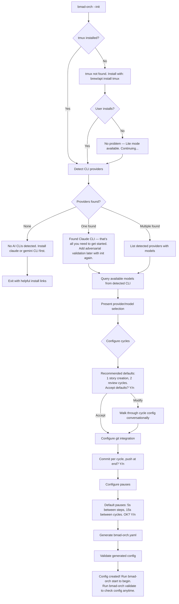
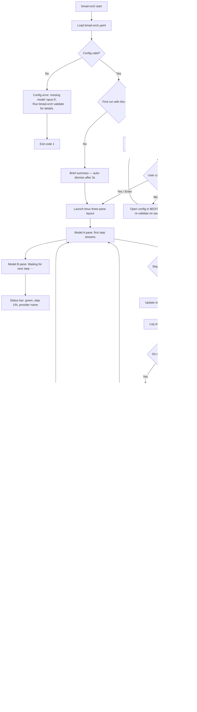
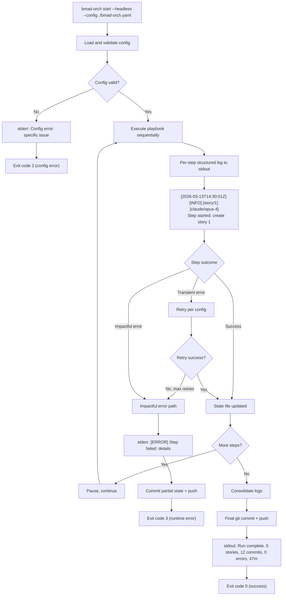

# UX Design Specification bmad-shell

**Author:** Bobby
**Date:** 2026-03-13

---

<!-- UX design content will be appended sequentially through collaborative workflow steps -->

## Executive Summary

### Project Vision

The BMAD Orchestrator replaces manual, attention-intensive BMAD workflow execution with an autonomous, config-driven engine that runs multi-model adversarial validation cycles unattended. The UX vision is "trust through transparency" — a tool that earns confidence by showing exactly what it does, intervenes only when it must, and leaves a legible trail of everything that happened. The interaction model spans two modes: an interactive tmux TUI for observation and intervention, and a headless mode for CI/CD pipelines and containers.

### Target Users

1. **Power User (Bobby/Creator)** — Runs BMAD workflows daily. Wants minimal friction, maximum automation. Configures once, tweaks occasionally, trusts the tool to run unattended. Values speed of setup, reliability of execution, and clarity of output.

2. **Team Developer (Sarah)** — Joins projects with existing configs. Needs to understand the playbook, observe execution, and intervene when models ask questions or flag issues. Values config portability, clear intervention signals, and resume from failure.

3. **Community Newcomer (Alex)** — First time automating BMAD. May have only one CLI installed. Needs guided onboarding with smart defaults and progressive complexity disclosure. Values low barrier to entry and a working first run.

4. **CI/CD Pipeline (Non-Human)** — Cares about exit codes, structured logs, and committed artifacts. Needs zero-interaction operation, clear failure signals, and machine-parseable output.

### Key Design Challenges

1. **Two-Mode Cognitive Split** — TUI and headless modes serve fundamentally different interaction models. The TUI must add observability value without distraction; headless output must be self-sufficient without the visual layer.

2. **Intervention Timing in Autonomous Flows** — The tool runs unattended but occasionally needs human input. Intervention points must be unmissable without creating alert fatigue — users must trust they can walk away AND know when to come back.

3. **Init Wizard Complexity Gradient** — Users range from experts who want fast configuration to newcomers who need guided defaults. Progressive disclosure must serve both without forking into separate flows.

4. **State Legibility Across Time** — State files, logs, and git history must tell a coherent story hours or days later. Users returning to failed runs need immediate situational awareness.

### Design Opportunities

1. **Trust Through Transparency** — Live model output and status bar earn user trust incrementally. The emotional arc of usage progresses from anxious watching (first run) to glancing (third run) to confident absence (tenth run). The UX must support all three states simultaneously.

2. **Command Pane as Safety Net** — More than a power interface, the command pane is what makes walking away feel safe. If users don't trust they can intervene cleanly, they'll never leave the terminal.

3. **Resume UX as Differentiator** — Contextual resume choices with enough state context to decide intelligently. The state file must contain human-readable descriptions and timestamps so the resume screen practically writes itself.

4. **Decision-Point Optimization** — Only four moments require user decisions: init wizard configuration, run-start playbook confirmation, mid-run intervention responses, and post-failure resume choices. Everything else is ambient observation. The UX should optimize these four decisional moments and make all other output glanceable.

## Core User Experience

### Defining Experience

The BMAD Orchestrator's core experience is **confident inaction**. The most frequent user "action" is not interacting — the tool's job is to make doing nothing feel productive. Users start a run and walk away. They come back to completed, committed, multi-model-validated work. The core loop is: configure once, start, walk away, return to results, review briefly, adjust config if needed, repeat.

The critical interaction to get right is the **init wizard** — it's the gateway to everything. If a user can't get from zero to a working config quickly and confidently, nothing else matters. The wizard must feel like a conversation with a knowledgeable colleague, not a config form to fill in. Limitations should be framed as choices ("You have Claude — that's all you need to get started. Add adversarial validation later with init again."), not deficiencies ("Only one provider detected."). BMAD itself handles recovery from failures gracefully, so the orchestrator's job is to stay out of the way during execution and surface only what requires a human decision.

### Platform Strategy

- **Terminal-native**: CLI commands + tmux-based TUI. No web, mobile, or graphical interface.
- **Keyboard-only**: All interactions via keyboard. No mouse dependency.
- **Local-first**: Orchestrates local CLI subprocesses on the user's machine. No network services required beyond what the AI CLIs themselves need.
- **Container/CI-ready**: Headless mode (Phase 1.5) strips the TUI layer, leaving pure subprocess execution with structured logs and exit codes.
- **Offline-capable**: The orchestrator itself has no network dependencies — connectivity requirements come from the underlying AI CLI providers.

### Effortless Interactions

1. **Starting a run** — `bmad-orch start` with an existing config is one command to execution. The playbook summary displays automatically as a pre-flight check — a 3-second scan, not a 30-second read — then execution begins.
2. **Ambient state awareness** — A glance at the TUI or status bar instantly communicates: running, waiting, needs-me, or done. No reading required — color and structure convey state in under one second.
3. **Returning to completed work** — A clear "done" state with a concise summary of what was accomplished, how many cycles ran, and what was committed. The user's re-entry cost is a 5-minute review, not a 30-minute investigation.
4. **Invisible recovery** — Transient failures (rate limits, timeouts, network blips) are handled silently by the orchestrator. Users never see them unless they choose to inspect logs. The system heals itself without surfacing noise.

### Critical Success Moments

1. **"It just worked"** — First-time user completes the init wizard, starts a cycle, walks away, and returns to completed work. This is the defining moment that converts a user into a believer. Everything in the UX serves this moment.
2. **"I can trust this"** — After watching 2-3 runs and seeing the TUI behave predictably — correct status, clean transitions, no surprises — the user stops watching. Trust is earned through observed consistency, not promised reliability.
3. **"That was easy"** — A team member pulls the repo, runs `bmad-orch start`, and the existing config just works. No setup, no init, no questions. Config portability eliminates onboarding friction for teams.

### Experience Principles

1. **Inaction is the product** — The best UX is the one the user never has to think about. Optimize for confident absence, not engaged interaction.
2. **Gateway first** — The init wizard is the highest-priority UX surface. A failed first run kills adoption permanently. Smart defaults, progressive disclosure, conversational tone, and a working config in under 5 minutes.
3. **Glanceable, not readable** — Every surface — status bar, TUI panes, completion summaries, playbook pre-flight checks — must communicate through structure and color, not paragraphs. One-second scan, not one-minute read.
4. **Decisions only when necessary** — Five decision points require user cognition: init wizard configuration, playbook pre-flight confirmation, run-start, mid-run intervention responses, and post-failure resume choices. Everything else is autopilot.
5. **Trust compounds** — Each successful unattended run builds confidence. The UX must never break this compounding effect with false alarms, unclear states, or unnecessary interruptions.
6. **Pre-flight, not speed bump** — The playbook summary is mandatory on first run of a config (catches typos, wrong models, missing variables before burning 30 minutes of API credits). After first successful run, it becomes skippable or auto-dismissing. Frame it as a pilot's checklist — quick, structured, confidence-building.

## Desired Emotional Response

### Primary Emotional Goals

1. **Relief** — "I don't have to babysit this." The dominant emotion is liberation from attention-intensive manual workflow execution. Users should feel their time and cognitive load have been genuinely returned to them.
2. **Confidence** — "It told me exactly what happened." When the system encounters issues, users should feel informed and in control, never blindsided. Transparency in failure builds more trust than flawless execution.
3. **Satisfaction** — "It just keeps going and getting it done." The quiet pride of watching loops complete, stories accumulate, and commits land. Not flashy excitement — the deep satisfaction of a system that reliably produces results.

### Emotional Journey Mapping

| Stage | Desired Emotion | Anti-Emotion to Avoid |
|---|---|---|
| **Discovery/Install** | Curiosity, low-stakes interest | Overwhelm, skepticism |
| **Init Wizard** | Guided confidence — "this knows what it's doing" | Confusion, decision paralysis |
| **First Run (watching)** | Fascinated observation — "oh, it's actually doing it" | Anxiety, distrust |
| **First Run (walking away)** | Cautious relief — "I think I can leave" | Fear of missing something |
| **Returning to completed work** | Satisfied surprise — "it actually finished everything" | Dread of checking what went wrong |
| **First completed run** | Milestone recognition — understated "first automated run complete" acknowledgment | Emotional flatness on a meaningful moment |
| **Subsequent runs** | Invisible confidence — "of course it worked" | Complacency masking fragility |
| **Failure/error** | Informed calm — "I know exactly what happened" | Panic, blame, confusion |
| **Resume after failure** | Controlled recovery — "I can fix this in 30 seconds" | Helplessness, starting-over dread |

### Micro-Emotions

- **Confidence over confusion** — Every surface (status bar, logs, state file, resume screen) must reinforce "you know what's happening." Ambiguity is the enemy.
- **Trust over skepticism** — Earned incrementally through observed consistency. Never demanded through messaging ("trust us!"). The TUI's live output is the trust-building mechanism.
- **Accomplishment over frustration** — Completed cycles should feel like *the user* accomplished something, not just the tool. The work product is theirs; the orchestrator is invisible infrastructure.
- **Calm over anxiety** — Error handling must feel measured and professional. The TUI shows a one-line headline; the log file contains full diagnostic depth. Error density in the interface kills calm — keep it to headlines, not walls of text.

### Design Implications

- **Relief** → Minimize required interaction. Every prompt, confirmation, or input request that isn't strictly necessary erodes the core emotional promise. Default aggressively.
- **Confidence** → Error messages are a first-class UX surface. Headline in the status bar (what happened), full context in the log file (what the system tried, what the user can do next). Error UX quality is a testable requirement — every error template should be reviewed for clarity like user-facing copy.
- **Satisfaction** → Completion summaries should celebrate throughput quietly. "3 stories completed, 12 commits pushed, 0 interventions required." Let the numbers speak. Exception: the very first completed run gets one understated milestone line — after that, pure numbers.
- **Informed calm** → The escalation ladder governs both urgency AND information density:
  - **Green** = minimal info (progress indicator only — "your attention is not needed")
  - **Yellow** = one-line context ("Model awaiting input" — "glance when convenient")
  - **Red** = headline + action ("Gemini timeout — resume options available" — "look now, here's why")

### Emotional Design Principles

1. **Disappearing tool** — The highest emotional compliment is "I forgot it was running." Design every interaction to get out of the way faster. This tool's emotional model is a reliable car, not a shiny gadget.
2. **Failure is a feature** — How the tool handles failure defines more trust than how it handles success. Graceful, informative, recoverable failure is emotionally superior to fragile perfection. Error paths deserve first-class testing — error message quality is a functional requirement.
3. **Numbers over narratives** — Completion stats, cycle counts, and timing data create quiet satisfaction without demanding attention. "5 cycles, 0 errors, 47 minutes" is more emotionally satisfying than "Great job! Everything worked!"
4. **Emotional escalation ladder** — Green (ignore me, minimal info) → Yellow (glance when convenient, one-line context) → Red (look now, headline + action). Never jump from green to panic. The ladder preserves calm and controls information density simultaneously.
5. **No performative enthusiasm** — No celebration banners, no congratulatory messages, no emoji fireworks. The tool's tone is professional, understated, results-oriented. One exception: the first-ever completed run gets a single understated milestone acknowledgment. After that, the output speaks for itself.

## UX Pattern Analysis & Inspiration

### Inspiring Products Analysis

**Claude CLI / Gemini CLI / Copilot CLI** — The primary inspiration sources are the AI CLI tools the target users already use daily. These tools define the interaction vocabulary users expect:

- **Streaming output** — Real-time token-by-token display of model thinking. This is the single most trust-building UX pattern in AI CLI tools. Users see the model working, not just waiting for a result. The Orchestrator must preserve this feel in its output panes.
- **Minimal chrome** — The interface is the conversation, not UI furniture around it. No sidebars, no menus, no decorative elements. Content dominates the viewport.
- **Fast startup** — From command to first visible output in seconds. No splash screens, no loading indicators, no preamble. The tool respects the user's time from the first keystroke.
- **Keyboard-native** — Every interaction works without a mouse. Tab completion, arrow keys, keyboard shortcuts. The hands never leave the keyboard.
- **Clear model identification** — Users always know which model they're interacting with. Provider and model name are visible without searching.

### Transferable UX Patterns

**Streaming Output as Trust Mechanism**
- Adopt directly: both TUI panes should stream live model output exactly as Claude/Gemini CLIs do today. The user should feel like they're watching two CLI sessions, not a custom application pretending to show CLI output.
- Do not reformat or normalize provider output — visual differences between Claude and Gemini output help users distinguish which model said what. The difference is a useful signal, not an inconsistency to fix.

**Three-Pane TUI Layout (tmux-native)**
- **Model A pane** (top or left) — Streams the active generative/validation model output
- **Model B pane** (middle or right) — Holds persistent output from the previous step, providing visible context for comparison
- **Command/Status pane** (bottom, thin strip ~5-6 lines) — Status bar, command input, and recent log lines
- The execution model is sequential, not parallel. One pane streams live while the other holds static content from its last completed step. The dual-pane value is **persistent context** — users see what Model A produced while Model B reviews it. This makes the adversarial review relationship visible.
- When a pane is idle, it displays `Waiting for next step` with a subtle breathing dot animation (···) at 1-second intervals to confirm the system is alive without being distracting.
- This three-pane layout naturally extends to Phase 2's four-pane layout by splitting one model pane — no rearchitecting required.

**Minimal Chrome / Content-First**
- Adopt directly: the TUI panes should look and feel like native terminal output. The command/status pane is the only persistent UI element. Everything else is content.

**Command Pane as Familiar Input**
- The command pane should feel like a terminal prompt the user already knows — not a custom input widget. Input routing to the active model should feel like typing in a CLI session.

**Fast Startup Pattern**
- `bmad-orch start` → playbook pre-flight summary → first pane streaming within seconds. Match the startup speed users expect from `claude` or `gemini` commands.

### Anti-Patterns to Avoid

1. **Custom TUI frameworks that don't feel like a terminal** — Tools like some ncurses-heavy applications that replace the terminal's native feel with a pseudo-GUI. The Orchestrator should feel like tmux + CLI sessions, not a terminal application pretending to be a desktop app.

2. **Progress bars for unpredictable durations** — AI model responses have variable length and timing. A progress bar that stalls at 47% for 3 minutes destroys confidence. Streaming output is the progress indicator — if tokens are flowing, progress is happening.

3. **Interruptive notifications** — Tools that steal focus, flash the terminal, or beep on every state change. The escalation ladder (green/yellow/red) handles urgency. No additional notification mechanisms unless the user configures them.

4. **Verbose startup sequences** — Tools that print version info, configuration summaries, dependency checks, and loading messages before doing anything useful. The pre-flight summary is the one allowed startup display — everything else should be silent or in logs.

5. **Hiding or reformatting model output** — Some orchestration tools summarize, filter, or normalize model output. Users of Claude/Gemini CLIs expect to see the raw streaming response. Don't abstract away what the model is actually saying, and don't normalize the visual differences between providers.

6. **Static idle states** — A pane showing a fixed "Waiting..." message for minutes looks frozen. Breathing animations or subtle indicators confirm liveness without demanding attention.

### Design Inspiration Strategy

**What to Adopt Directly:**
- Streaming output display — identical feel to Claude/Gemini CLI output, unmodified per provider
- Keyboard-native interaction — no mouse dependencies
- Minimal chrome — content-first, command/status pane as only persistent UI element
- Fast startup — command to first output in seconds

**What to Extend:**
- Single-pane CLI → three-pane layout (Model A, Model B, Command/Status). Users get the familiar CLI output feel with persistent cross-model context. Sequential execution with visible comparison — "watching two experts work."
- Single-session model identification → multi-model status bar showing which provider is active in which pane, current step, and cycle progress.
- Static idle → breathing dot animation for liveness indication.

**What to Avoid:**
- Custom TUI frameworks that break terminal-native feel
- Progress bars for unpredictable AI operations
- Any output filtering, summarization, or normalization that hides what models are actually producing
- Startup ceremony beyond the pre-flight summary
- Static idle states that look like frozen processes

## Design System Foundation

### Design System Choice

**Hybrid: tmux (layout + structural chrome) + Rich (command pane formatting)** — tmux manages the three-pane layout and pane headers as the structural engine, Rich handles formatting exclusively within the command/status pane. Model output panes remain raw subprocess output. This three-layer separation delivers terminal-native feel with polished informational styling and zero rendering conflicts. Terminal-native is the brand — the design system reinforces this positioning.

### Rationale for Selection

1. **Zero-friction install** — Rich is a Python package bundled in `pyproject.toml`. Users run `pip install bmad-orch` (or `pipx install bmad-orch`) and everything resolves automatically. tmux is a soft dependency — recommended but not required for basic operation.
2. **Terminal-native feel** — tmux owns pane layout, splitting, resizing, and pane headers — patterns users already understand. Rich adds styling only in the command pane without taking over the screen or introducing a custom event loop.
3. **Rich over Textual** — Textual is a full TUI framework with its own event loop that would fight tmux for control. Rich is a formatting/output library — lightweight, no widget framework overhead, simple print-like API. It stays out of the way.
4. **No rendering conflicts** — Rich never manages model output panes. Pane headers use tmux's native `pane-border-format`, eliminating scroll-off issues and output interception latency. Each layer has a single owner.
5. **Proven and popular** — Rich is one of the most widely used Python terminal libraries (~50k GitHub stars), well-maintained, with excellent documentation. Low risk, low learning curve.
6. **Competitive positioning** — Terminal-native + tmux-based is a deliberate market position. Competing orchestration tools (LangChain, CrewAI, AutoGen) are library-first with optional web dashboards. This tool is FOR terminal users, not a web dashboard that happens to run from the command line.

### Three Operational Modes

**1. TUI Mode (default — requires tmux)**
- Full three-pane layout: Model A, Model B, Command/Status
- tmux pane borders with escalation colors, Rich-formatted command pane
- Complete visual experience as designed

**2. Lite Mode (implicit when tmux unavailable)**
- No tmux — Rich IS available
- Single-pane sequential experience: model output streams one at a time, Rich formats status updates, escalation colors, pre-flight summaries, and completion reports
- Degraded but still visual — styled status bars, colored escalation, formatted tables
- Fills the gap between full TUI and headless. Users without tmux still get a meaningful visual experience.

**3. Headless Mode (`--headless` flag)**
- No tmux, no Rich — entire visual layer peels off
- Structured plain text with timestamps and severity tags
- Machine-parseable, grep-friendly — for CI/CD pipelines and containers
- Exit codes for scripting integration

**tmux Detection & Guidance:**
- Init wizard step zero: detect tmux before provider detection
- If missing on macOS: "tmux not found. Install with: `brew install tmux`"
- If missing on Linux: "tmux not found. Install with: `sudo apt install tmux` or `sudo dnf install tmux`"
- If user declines or can't install: "No tmux? No problem — you'll run in Lite mode with styled terminal output. Install tmux later for the full TUI experience."
- tmux never blocks adoption. Users get value immediately.

### Implementation Approach

**Layer 1 — Layout + Structural Chrome (tmux) [TUI mode only]:**
- Three-pane layout: Model A (top), Model B (middle), Command/Status (bottom)
- tmux controls pane creation, sizing, splitting, and destruction
- Pane proportions: model panes get majority of vertical space, command pane ~5-6 lines
- **Pane headers via `pane-border-format`** — pinned, non-scrolling pane labels showing provider name, model, current step, and pane state. Updated dynamically via `tmux select-pane -T`
- **Escalation colors in pane borders** — tmux pane border colors carry green/yellow/red semantics. Users glance at border color to know pane state without reading text.
- Phase 2 extensibility: four-pane layout is a single additional tmux split

**Layer 2 — Informational Chrome (Rich) [TUI + Lite modes]:**
- **TUI mode scope: command/status pane only** — Rich never renders to model output panes
- **Lite mode scope: full terminal** — Rich formats all status output, model output streams raw between Rich-formatted headers
- **Status bar** — Rich-formatted status line: `[story 2/5] step 3/4 | claude | cycle 1/2 | ▓▓▓░░ 60% | 12m elapsed | ✓ ok`
- **Escalation colors** — Same green/yellow/red palette as tmux borders, applied to status text via Rich's color system
- **Pre-flight summary** — Rich tables for playbook display — scannable in 3 seconds
- **Completion reports** — Rich-formatted stats: cycle counts, commit counts, timing, error counts
- **Error headlines** — Rich-styled one-line error summaries with severity coloring

**Layer 3 — Content (Raw Output) [All modes]:**
- Model streaming output remains completely unmodified — exactly as the CLI produces it
- In TUI mode: each model pane is a tmux pane running a subprocess
- In Lite mode: model output streams sequentially to the terminal
- In Headless mode: model output captured to log files
- Visual differences between provider outputs preserved in all modes

**Escalation State Architecture:**
- Single state object drives all escalation rendering across all layers
- When state transitions (e.g., `ok` → `attention`), one function atomically updates both tmux border color AND Rich status color
- No independent code paths, no race conditions, no contradictory signals between layers
- State machine is testable independently of renderers — UX correctness lives in state transitions, not rendering

### Customization Strategy

**Color Tokens (shared across tmux and Rich):**
- `ok` (green) — nominal state, no attention needed
- `attention` (yellow) — model awaiting input, non-critical event
- `action` (red) — error, intervention required
- `dim` — secondary/idle information (timestamps, muted text)
- `bold` — active/important elements (provider names, active step)
- All colors terminal-safe and selected for colorblind accessibility

**Pane Header Format [TUI mode]:**
- `[provider icon] Provider Name | model-name | step description [active/waiting]`
- Updated dynamically as steps progress via tmux pane title API
- Border color matches escalation state

**Status Bar Format [TUI + Lite modes]:**
- Fixed-format segments separated by `|`, left-to-right priority (most important info first)
- `[cycle type step/total] step N/M | provider | cycle R/T | progress | elapsed | state`

**Component Patterns:**
- Error display: headline in command pane (Rich), full context in log file — never both in the same surface
- Idle indicator: breathing dots in command pane + "Waiting for next step" in pane header
- Pre-flight: Rich table, auto-dismiss after first successful run

## Defining User Experience

### Defining Experience

**"Start and forget."**

The BMAD Orchestrator's defining experience is the moment a user types `bmad-orch start`, walks away from their terminal, and returns to completed, committed, multi-model-validated work. Everything in the UX exists to make this moment reliable, trustworthy, and repeatable.

This is the dishwasher model: load the config (once), press start, walk away, come back to clean results. Users don't describe the wash cycle to their friends — they describe the freedom. "I kicked off a full story cycle before lunch and came back to everything done." That's the sentence the UX must earn.

Multi-model adversarial validation and the dual-pane TUI are trust mechanisms that support "start and forget" — they're how users build confidence to walk away, not the experience itself. The TUI is training wheels that become unnecessary. The validation is quality assurance that runs invisibly.

### User Mental Model

**Current state (manual execution):**
Users currently run BMAD workflows by hand — invoking Claude CLI, copying output, switching to Gemini for review, pasting context, committing results, repeating for each step. It works, but it's hand-washing every dish individually. Every step requires active attention and manual transitions.

**Mental models users bring:**
- **Build systems** — `make build` or `npm run build`: kick off a command, wait for it to finish, check the result. Users already understand "run and wait."
- **CI/CD pipelines** — GitHub Actions, Jenkins: trigger a workflow, walk away, check the green/red status later. Users already understand "fire and forget with status checks."
- **tmux sessions** — Detach from a session, do other work, reattach later. Users already understand persistent terminal processes that outlive their attention.

**The novel element:**
Trusting an AI orchestration loop to produce quality output unattended. This is the gap between "I ran a build" and "I let two AI models create and review my code without me." The multi-model validation cycle exists to close this trust gap — it's the mechanism that makes "start and forget" feel safe rather than reckless.

**User workarounds today:**
- Running AI CLIs in tmux panes manually and switching between them
- Keeping notes on which step they're on and which model ran what
- Manually copying output between models for cross-review
- Committing in batches and hoping they don't lose work to a crash

### Success Criteria

1. **Physical departure** — User starts a run and physically leaves the terminal with confidence. Not "I'll check back in 5 minutes" — actual departure.
2. **Unambiguous return** — User returns to a clear terminal state: completed (green, summary visible), failed (red, headline visible), or in-progress (streaming, status bar updating). Never ambiguous, never mid-transition.
3. **Review-ready output** — Completed work is ready for a brief human review (5 minutes), not a debugging or reformatting session. Artifacts are committed, logs are consolidated, state is clean.
4. **Self-explanatory failure** — If something failed, the failure state tells the user what happened and what to do next without consulting logs. The resume flow presents clear options with enough context to decide.
5. **Repeatable confidence** — Each successful "start and forget" cycle increases the user's willingness to walk away earlier and stay away longer. By the tenth run, starting the orchestrator is as thoughtless as starting a dishwasher.

### Novel UX Patterns

**Pattern type: Established patterns combined in a novel context.**

The individual interaction patterns are all familiar:
- CLI command execution (established)
- tmux pane layout (established)
- Status bars and progress indication (established)
- Streaming terminal output (established)

The novelty is the **trust architecture** — the combination of patterns that lets users trust autonomous AI workflow execution:
- Dual-pane persistent context (watch Model A's output while Model B reviews it)
- Escalation ladder (green/yellow/red) across pane borders and status bar
- Pre-flight summary as a confidence checkpoint
- Resume flow with contextual state information

No new interaction paradigms need to be taught. The innovation is in how established patterns combine to create trust for a new category of tool. Users need zero UX education — they need confidence that the familiar patterns are reliable.

### Experience Mechanics

**1. Initiation:**
- User types `bmad-orch start` (or `bmad-orch start --config path`)
- Orchestrator loads config, detects providers, validates
- Pre-flight summary displays in Rich table format (3-second scan)
- User confirms or the summary auto-dismisses (after first successful run with this config)
- tmux layout launches: three panes appear, first model begins streaming

**2. Interaction (active observation — optional):**
- Model A pane streams generative output (e.g., story creation via Claude)
- Model B pane shows "Waiting for next step ···"
- Status bar shows: `[story 1/5] step 1/4 | claude | cycle 1/2 | ▓░░░░ 20% | 3m elapsed | ✓ ok`
- Pane borders glow green — all nominal
- User watches, builds confidence, eventually walks away
- If model asks a question: pane border turns yellow, status bar shows "Model awaiting input", command pane highlights the question. User responds via command pane or — if away — the orchestrator handles the timeout gracefully per config.

**3. Feedback (ambient — no interaction required):**
- Status bar continuously updates with step/cycle progress
- Pane borders maintain escalation color state
- Completed steps are logged, state file updated atomically
- Transient errors (rate limits, timeouts) handled invisibly with retry
- Impactful errors: pane border turns red, status bar shows headline, state committed

**4. Completion:**
- All cycles complete. Status bar shows final summary: `✓ Complete | 5 stories | 12 commits | 47m | 0 errors`
- First run only: one additional line — "First automated run complete."
- Model panes show final output from last steps
- Git commits and push completed per config
- State file records complete run history
- User returns, scans the summary, reviews artifacts — 5-minute human checkpoint

## Visual Design Foundation

### Color System

**Philosophy: Terminal-native with a whisper of brand identity.**

The orchestrator inherits the user's terminal theme as its base — no forced backgrounds, no overridden foregrounds. Color is used sparingly and semantically, never decoratively. The only deliberate color choices are the escalation states and a single subtle brand accent.

**Semantic Color Tokens:**

| Token | ANSI Mapping | Purpose |
|---|---|---|
| `brand` | Blue (ANSI 4 / bright blue) | BMAD identity — pane header provider labels, startup banner, pre-flight table borders. Used sparingly as the one recognizable accent. |
| `ok` | Green (ANSI 2) | Nominal state — pane borders when running normally, success indicators, completion stats |
| `attention` | Yellow (ANSI 3) | Needs glance — model awaiting input, non-critical warnings, approaching thresholds |
| `action` | Red (ANSI 1) | Needs now — errors, impactful failures, halted execution |
| `content` | Terminal default foreground | All model output, primary text — inherits user's theme |
| `secondary` | Dim (ANSI dim attribute) | Timestamps, elapsed time, secondary status segments, idle indicators |
| `emphasis` | Bold (ANSI bold attribute) | Active provider names, current step, important status values |

**Color Rules:**
- Maximum of 2 colors visible at any time in the status bar (brand accent + one escalation state)
- Model output panes: ZERO orchestrator-applied color — content streams in whatever the AI CLI produces
- Pane borders: one color at a time (escalation state)
- When in doubt, use dim over color. Color means something; dim means "less important."
- No background colors applied by the orchestrator — ever. Background is always the user's terminal default.

**ANSI Compatibility:**
- All color tokens map to base ANSI 16 colors for maximum terminal compatibility
- Rich handles the mapping — if a terminal supports 256 or truecolor, Rich can enhance automatically
- Colorblind consideration: green/yellow/red is supplemented by the status text itself (ok/attention/action) — color is never the sole signal

### Typography System

**Terminal typography is constrained to the user's monospace font.** The orchestrator does not choose typefaces. Instead, it uses ANSI text attributes as its typographic system:

**Text Hierarchy:**

| Level | Attributes | Usage |
|---|---|---|
| **Header** | Bold + brand color | Pane header labels, pre-flight table title, section headers in completion reports |
| **Active** | Bold | Current provider name, active step description, important values |
| **Normal** | Default | Status bar segments, log entries, general text |
| **Secondary** | Dim | Timestamps, elapsed time, cycle counts when not the focus, breathing dots |
| **Alert** | Bold + escalation color | Error headlines, intervention prompts, status warnings |

**Text Rules:**
- Bold means "look at this." Use it for the one thing per line that matters most.
- Dim means "this is here if you need it." Timestamps, secondary counters, separators.
- No underline (too visually heavy in terminals, often confused with links).
- No inverse/reverse video (used by terminal selection, don't compete with it).
- No blinking text — ever.

### Spacing & Layout Foundation

**Spacing unit: 1 character width / 1 line height.** All spacing is character-based.

**Pane Layout Proportions (TUI mode):**
```
┌─────────────────────────────────────┐
│ Model A pane          (~40% height) │
│ [provider header in pane border]    │
│                                     │
├─────────────────────────────────────┤
│ Model B pane          (~40% height) │
│ [provider header in pane border]    │
│                                     │
├─────────────────────────────────────┤
│ Command/Status pane   (~20% / 5-6 lines) │
│ [status bar] [input] [recent log]   │
└─────────────────────────────────────┘
```

**Status Bar Layout (left-to-right priority):**
```
[story 2/5] step 3/4 | claude | cycle 1/2 | ▓▓▓░░ 60% | 12m | ✓ ok
 ^^^^^^^^^  ^^^^^^^^   ^^^^^^   ^^^^^^^^^   ^^^^^^^^^   ^^^   ^^^^
 cycle id   step       provider  repeat     progress   time  state
 (bold)     (normal)   (brand+   (normal)   (dim)      (dim) (escalation
                        bold)                                  color)
```

**Spacing Rules:**
- Status bar segments separated by ` | ` (space-pipe-space) — 3 characters between segments
- No segment padding beyond the pipe separator
- If terminal width is too narrow, truncate from right (drop least-important segments first: time, progress, repeat count)
- Pane headers: 1 space padding on each side of the header text within the tmux border
- No decorative borders, boxes, or frames beyond tmux's native pane borders

**Information Density:**
- Command pane: dense — every line has a purpose (status bar, input line, 3-4 recent log lines)
- Model panes: sparse — raw model output with natural whitespace as the model produces it
- Pre-flight summary: medium — Rich table with compact padding, scannable in 3 seconds

### Accessibility Considerations

**Color Accessibility:**
- All escalation states (ok/attention/action) are communicated through both color AND text labels — color is never the sole signal
- ANSI base 16 colors are universally supported and render distinctly in both light and dark terminal themes
- No red/green distinction without accompanying text (yellow serves as the middle state, breaking the red-green binary)

**Terminal Compatibility:**
- All visual elements degrade gracefully: truecolor → 256 color → 16 color → monochrome (bold/dim only)
- Rich handles automatic color downgrade based on terminal capability detection
- Headless mode produces zero ANSI codes — plain text with severity tags

**Readability:**
- Bold used sparingly — maximum one bold element per status bar segment
- Dim used for de-emphasis, never for critical information
- No dense color combinations — maximum 2 colors per visual line
- Status bar is readable at 80 columns minimum; graceful truncation below that

## Design Direction Decision

### Design Directions Explored

Three terminal-native design directions were evaluated, each showing the same mid-run state (story cycle, step 3, Claude active, Gemini waiting):

**Direction A: Ultra-Minimal** — tmux borders do all structural work, status bar compressed to one line, command pane is just a prompt. Maximum content, minimum chrome. Feels like raw tmux with smart borders.

**Direction B: Structured Status** — Status bar gets its own bordered Rich section, recent log lines visible below, more information density in the command pane. Feels like a well-configured monitoring tool.

**Direction C: Clean Separation** — Full box-drawing borders create a cohesive framed application. Strongest visual identity but adds border chrome that competes with tmux's native pane borders.

### Chosen Direction

**Direction B: Structured Status**

The chosen direction features:
- tmux pane borders with dynamic headers for model identification (Layer 1)
- A Rich-formatted command pane with a visually distinct status bar section, recent log lines, and input prompt (Layer 2)
- Raw, unmodified model output in both model panes (Layer 3)

**Reference Layout:**
```
─── 🤖 Claude | opus-4 | create story ─────────────────── ACTIVE ───

[raw model streaming output]

─── 🤖 Gemini | 2.5-pro ──────────────── Waiting for next step ··· ───

[previous step output / idle state]

━━━━━━━━━━━━━━━━━━━━━━━━━━━━━━━━━━━━━━━━━━━━━━━━━━━━━━━━━━━━━━━━━━
 story 1/3 │ step 3/4 │ claude │ cycle 1/2 │ ▓▓▓░░ 60% │ 12m │ ✓ ok
━━━━━━━━━━━━━━━━━━━━━━━━━━━━━━━━━━━━━━━━━━━━━━━━━━━━━━━━━━━━━━━━━━
 [14:23:01] Step 3 started: create story 2.3 via Claude
 [14:22:45] Step 2 complete: adversarial review passed (Gemini)
> _
```

### Design Rationale

1. **Best "glance and know" support** — The structured status section with Rich formatting creates a visually distinct zone that the eye finds immediately. Users returning to the terminal don't scan the model output — they scan the status bar. Direction B makes this scan instant.

2. **Log lines provide context without log files** — The 2-3 recent log lines below the status bar give returning users immediate context: "what just happened?" without opening a log file. This directly supports the "self-explanatory failure" success criterion.

3. **Model panes stay clean** — Unlike Direction C's box-drawing borders, Direction B uses tmux's native pane borders for model separation. Model output remains raw and unframed — exactly as the CLI produces it.

4. **Monitoring tool mental model** — Direction B feels like htop or a well-configured tmux status bar — tools terminal users already know and trust. It doesn't try to be an application; it tries to be a smart terminal layout.

5. **Information density matches emotional design** — The command pane is dense (every line has a purpose), the model panes are sparse (raw output with natural whitespace). This contrast naturally draws the eye to the command pane for status and to the model panes for content — exactly the right attention split.

### Implementation Approach

**Command Pane Structure (Rich-formatted, ~5-6 lines):**
```
Line 1: ━━━ Rich horizontal rule (visual separator from model panes)
Line 2: Status bar segments: cycle | step | provider | repeat | progress | time | state
Line 3: ━━━ Rich horizontal rule
Line 4: Recent log entry (most recent)
Line 5: Recent log entry (previous)
Line 6: > [input prompt]
```

**Status Bar Rendering:**
- Rich `Table` or `Columns` layout with `│` segment separators
- Provider name in brand color (blue) + bold
- State indicator in escalation color (green/yellow/red)
- Progress bar using Rich's bar rendering (`▓░` characters)
- Time and secondary metrics in dim

**Log Line Rendering:**
- Timestamp in dim: `[14:23:01]`
- Event description in normal: `Step 3 started: create story 2.3 via Claude`
- Rolling buffer — newest at top, oldest drops off as new events arrive
- Error events rendered in escalation color with bold

**Pane Header Rendering (tmux `pane-border-format`):**
- Format: `─── [icon] Provider | model | step description ─── STATE ───`
- STATE values: `ACTIVE` (bold), `Waiting for next step ···` (dim + breathing dots), `COMPLETE` (green), `ERROR` (red + bold)
- Border color matches escalation state

**Escalation Visual States:**

| State | Pane Border | Status Bar State | Log Line Style |
|---|---|---|---|
| Nominal | Green border | `✓ ok` in green | Normal text |
| Attention | Yellow border | `⚠ awaiting input` in yellow | Yellow highlight |
| Action | Red border | `✗ error` in red + bold | Red + bold |
| Complete | Green border | `✓ complete` in green + bold | Green text |
| Idle | Default border | `· waiting` in dim | Dim text |

## User Journey Flows

### Flow 1: Init Wizard (Journeys 1 & 4)

**Goal:** Zero to working config in under 5 minutes. Conversational, not form-like.



**Key UX Decisions:**
- Every question has a sensible default that can be accepted with Enter
- Single-provider detection is framed positively ("that's all you need"), not as a limitation
- Model querying happens automatically — users pick from a list, never type model names
- Config validation runs automatically before saving — user never gets a broken config
- Exit with helpful guidance if no providers found — don't leave users stranded

**Conversational Tone Examples:**
- "I found Claude CLI with opus-4 and sonnet-4. Which model for generative steps?" (not "Select primary provider model:")
- "How many review rounds? Most users do 2 — enough to catch issues without burning credits." (not "Enter cycle repeat count:")
- "All set! Here's your config summary:" (not "Configuration generation complete.")

---

### Flow 2: Happy Path Run (Journey 1)

**Goal:** Start to completion with zero intervention. The "start and forget" experience.



**Key UX Moments:**
- **Pre-flight (3 seconds):** Rich table shows providers, cycles, steps, prompts. Scannable, not readable. Catches config typos before burning API credits.
- **Pane switch:** When execution moves from Model A to Model B, the active pane starts streaming and the status bar updates provider name. The previously active pane retains its output as persistent context.
- **Walking away:** Nothing changes about the UX when the user leaves. The TUI continues updating. tmux session persists. User reattaches later and sees current state instantly.
- **Return:** Status bar and pane borders tell the story in one glance. Green + "Complete" = done. Green + streaming = still running. Red = needs attention.

---

### Flow 3: Intervention & Resume (Journey 2)

**Goal:** Handle mid-run interactions and failure recovery without losing trust.

```mermaid
flowchart TD
    subgraph "Mid-Run Intervention"
        A[Model asks a question] --> B[Pane border turns yellow]
        B --> C["Status bar: ⚠ awaiting input"]
        C --> D["Command pane: ⚠ Claude asks: 'Should I include
        error handling ACs for timeout scenarios?'"]
        D --> E{User present?}
        E -->|Yes| F[User types response in command pane]
        F --> G[Input routed to active model subprocess]
        G --> H[Pane border returns to green]
        H --> I[Execution continues]
        E -->|No / Timeout| J{Timeout config?}
        J -->|Skip step| K[Log timeout, skip to next step]
        J -->|Pause| L[Remain in yellow state until user returns]
        J -->|Auto-respond| M[Send configured default response]
        K --> I
        L --> F
        M --> I
    end

    subgraph "Impactful Error"
        AA[Provider crashes / unrecoverable error] --> BB[Pane border turns red]
        BB --> CC["Status bar: ✗ Gemini subprocess terminated"]
        CC --> DD[State file updated atomically]
        DD --> EE[Emergency git commit + push]
        EE --> FF["Command pane log:
        [14:45:02] ✗ ERROR: Gemini subprocess terminated (exit 137)
        [14:45:02] State saved. Partial work committed and pushed.
        [14:45:02] Run bmad-orch resume to continue."]
        FF --> GG[Execution halted]
    end

    subgraph "Resume Flow"
        RA[bmad-orch resume] --> RB[Load state file]
        RB --> RC["Display resume context:
        Last run: 2026-03-13 14:30
        Stopped at: story cycle, step 3/4 (Gemini review)
        Reason: Gemini subprocess terminated
        Completed: 2/5 stories, steps 1-2 of story 3"]
        RC --> RD{Resume options}
        RD --> RE["[1] Re-run failed step (Gemini review of story 3)"]
        RD --> RF["[2] Skip failed step, continue to step 4"]
        RD --> RG["[3] Restart current cycle (story 3 from step 1)"]
        RD --> RH["[4] Start from scratch (all stories)"]
        RE --> RI[Launch TUI, execute from chosen point]
        RF --> RI
        RG --> RI
        RH --> RI
    end
```



**Key UX Decisions:**
- **Yellow state is patient** — It doesn't escalate to red. It waits. The user might be at lunch. Yellow means "when you get back" not "drop everything."
- **Timeout behavior is configurable** — Some users want auto-skip, some want to pause indefinitely, some want a default response. The config decides, not the tool.
- **Error context is immediate** — The command pane log shows exactly what happened, when, and what to do next. No log file hunting required.
- **Resume is contextual** — The resume screen shows enough state to make a decision: what was running, where it stopped, why, and what's already done. Users pick from numbered options, not guess commands.
- **Emergency commit preserves work** — Impactful errors trigger commit + push before halting. Completed work is never lost.

---

### Flow 4: Headless Contract (Journey 3)

**Goal:** Zero-interaction execution with machine-parseable output for CI/CD.



**Exit Code Contract:**

| Code | Meaning | CI/CD Action |
|---|---|---|
| 0 | Success — all cycles completed | Pipeline passes |
| 1 | Usage error — bad flags, missing args | Fix invocation |
| 2 | Config error — invalid yaml, missing provider, bad model | Fix config |
| 3 | Runtime error — impactful failure during execution | Check state file + logs |
| 4 | Provider error — all retries exhausted for a provider | Check provider status |

**Structured Log Format:**
```
[ISO-8601 timestamp] [SEVERITY] [cycle/step] [provider/model] Message
```

**Headless Differences from TUI:**
- No tmux, no Rich, no ANSI colors
- All output to stdout (operational) and stderr (errors)
- State file is the primary status mechanism — external tools poll it
- Retries handled silently with log entries (no user intervention possible)
- Same state file format — a headless run can be resumed in TUI mode and vice versa

---

### Journey Patterns

**Pattern: Escalation Communication**
Used across all flows. State changes are communicated through the same escalation system regardless of mode:
- TUI: pane border color + status bar + command pane log
- Lite: Rich-styled status line + inline log
- Headless: structured log severity + exit code

**Pattern: Graceful Degradation**
Every flow has a degraded path that still delivers value:
- No tmux → Lite mode (still visual)
- No second provider → single-model cycles (still automated)
- Model timeout → configurable fallback (skip/pause/auto-respond)
- Crash → emergency commit (work preserved)

**Pattern: Contextual Decision Points**
Every decision point shows enough context to decide without external investigation:
- Pre-flight: full playbook visible before confirming
- Intervention: the model's question visible in command pane
- Resume: last run state, failure reason, and completed work visible before choosing
- Init wizard: detected providers and models visible before selecting

**Pattern: State as Source of Truth**
The JSON state file is the single source of truth across all modes:
- TUI reads state to render status bar
- Resume reads state to present options
- Headless writes state for external monitoring
- State survives crashes (atomic writes)
- State is human-readable (audit trail) AND machine-parseable (tooling)

### Flow Optimization Principles

1. **Minimum steps to value** — Init wizard: 5 questions with defaults → working config. Happy path run: 1 command → walk away. Resume: 1 command → numbered choice → running.
2. **No dead ends** — Every error state has a clear next action. Every flow has a recovery path. No screen ever leaves the user without guidance on what to do.
3. **Progressive context** — Show less by default, more on demand. Status bar shows headline, log file has the story. Pre-flight shows the plan, `--dry-run` shows every detail.
4. **Mode portability** — A run started in TUI can be resumed in headless and vice versa. A config created by Bobby works for Sarah without modification. State files are portable across modes and users.

## Component Strategy

### Design System Components

**tmux (structural layer) provides:**
- Pane splitting, resizing, and destruction
- Pane border rendering with `pane-border-format` for dynamic headers
- Pane border coloring for escalation states
- Session persistence (detach/reattach — critical for "start and forget")
- Keyboard binding for shortcuts (pause, skip, abort, restart)

**Rich (formatting layer) provides:**
- Styled text output (bold, dim, ANSI color tokens)
- Tables (pre-flight summary, completion reports)
- Horizontal rules (status bar separators)
- Spinners (breathing dots for idle states)
- Progress bars (`▓░` character rendering)
- Columns layout (status bar segment arrangement)

### Custom Components

#### 1. Status Bar

**Purpose:** Primary glanceable element — tells the user everything they need to know in one scan.
**Location:** Command pane, line 2 (between Rich horizontal rules)
**Content:** Cycle ID, step progress, active provider, repeat count, progress bar, elapsed time, escalation state
**Format:** `[story 2/5] step 3/4 | claude | cycle 1/2 | ▓▓▓░░ 60% | 12m | ✓ ok`
**States:**
- Nominal: state segment in green (`✓ ok`)
- Attention: state segment in yellow (`⚠ awaiting input`)
- Action: state segment in red + bold (`✗ error`)
- Complete: state segment in green + bold (`✓ complete`)
- Idle: state segment in dim (`· waiting`)
**Responsive:** Truncates segments right-to-left (time → progress → repeat → step) when terminal width < 80 columns
**Implementation:** Rich Columns or formatted string with ANSI tokens

#### 2. Pane Header

**Purpose:** Identifies which provider/model is in each pane and its current state.
**Location:** tmux pane border (top edge of each model pane)
**Content:** Provider icon, provider name, model name, step description, state label
**Format:** `─── 🤖 Claude | opus-4 | create story ─── ACTIVE ───`
**States:**
- ACTIVE (bold) — currently streaming output
- Waiting for next step ··· (dim + breathing dots) — idle, awaiting next assignment
- COMPLETE (green) — finished all assigned steps
- ERROR (red + bold) — step failed in this pane
**Implementation:** tmux `pane-border-format` with dynamic title updates via `tmux select-pane -T`

#### 3. Pre-Flight Summary

**Purpose:** Confidence checkpoint before execution — catches config mistakes in a 3-second scan.
**Location:** Command pane (full pane, before tmux layout launches)
**Content:** Rich table showing all cycles, steps, providers, models, and prompt templates
**States:**
- First run: displayed and waits for confirmation
- Subsequent runs: displayed briefly (3s auto-dismiss) or skipped with `--no-preflight`
**Implementation:** Rich Table with brand-colored borders

#### 4. Command Pane Log

**Purpose:** Rolling context for returning users — "what just happened?" at a glance.
**Location:** Command pane, lines 4-5 (below status bar, above input prompt)
**Content:** 2-3 most recent events with timestamps
**States:**
- Normal events: dim timestamp + normal description
- Error events: dim timestamp + red bold description
- Completion events: dim timestamp + green description
**Behavior:** Rolling buffer — newest at top, oldest drops off. Never scrolls the command pane.
**Implementation:** Rich styled text, managed by a fixed-size deque

#### 5. Completion Report

**Purpose:** End-of-run summary — tells the returning user "here's what happened."
**Location:** Command pane (replaces status bar with final report)
**Content:** Cycle counts, story counts, commit counts, push status, timing, error count
**States:**
- Success: green `✓ Complete`, all stats in normal text
- Partial (errors occurred): yellow `⚠ Partial`, error count in red
- First run: adds one milestone line below the stats
**Implementation:** Rich formatted string replacing the live status bar

#### 6. Resume Context Screen

**Purpose:** Give the user enough information to choose how to resume without reading logs.
**Location:** Full terminal (before TUI launches)
**Content:** Last run timestamp, failure point, failure reason, completed work summary, numbered options
**States:** Single state — always shows context + options
**Implementation:** Rich styled text, reads from JSON state file

#### 7. Init Wizard Prompts

**Purpose:** Conversational config creation — the gateway experience.
**Location:** Full terminal (no tmux)
**Content:** Sequential questions with defaults, provider/model detection results, config summary
**States:**
- Question: prompt with default in brackets
- Detection result: list with recommendations
- Summary: Rich table of generated config
- Error: helpful message with remediation
**Tone:** Conversational, not form-like. Frames limitations as choices.
**Implementation:** Rich styled prompts with Python `input()` for responses

#### 8. Error Headline

**Purpose:** One-line error summary in the command pane — severity + what happened + next action.
**Location:** Command pane log area (appears as a log entry)
**Content:** Severity indicator, error description, suggested action
**Format:** `✗ Gemini subprocess terminated (exit 137) — run bmad-orch resume`
**States:**
- Recoverable (logged, execution continues): yellow, no action suggested
- Impactful (execution halted): red + bold, action suggested
**Implementation:** Rich styled text with escalation color

### Component Implementation Strategy

**Rendering Ownership:**
- Components 1, 3, 4, 5, 6, 7, 8 → Rich (formatting layer)
- Component 2 → tmux (structural layer)
- No component spans both layers — clean separation maintained

**Shared State:**
- All components read from the single escalation state object
- Color tokens are consistent across all components (same green/yellow/red everywhere)
- Components never independently decide escalation state — they only render it

**Testing Strategy:**
- Each component is a pure function: state in → formatted string out
- Test against expected ANSI output strings for each state
- Error headlines tested as user-facing copy — clarity and accuracy verified
- Integration test: state transition → all components update atomically

### Implementation Roadmap

**Phase 1 — MVP Core (required for "start and forget"):**
1. Status Bar — the primary glanceable element
2. Pane Header — model identification and state
3. Pre-Flight Summary — config confidence checkpoint
4. Command Pane Log — rolling event context
5. Completion Report — end-of-run summary
6. Init Wizard Prompts — the gateway experience
7. Error Headline — failure communication

**Phase 1 — MVP Supporting:**
8. Resume Context Screen — failure recovery flow

**Phase 1.5 — Headless:**
- All components have headless equivalents (plain text, structured logs)
- No new components — same information, no styling

**Phase 2 — Enhancements:**
- Four-pane layout (split one model pane) — existing components adapt, no new ones
- Richer status display (analytics, history) — extends Status Bar and Completion Report

## UX Consistency Patterns

### Keyboard Shortcuts

**Design Principle:** Shortcuts use familiar terminal conventions. No custom modifier keys. All shortcuts work in the command pane only — model panes are output-only.

**Execution Control Shortcuts:**

| Shortcut | Action | Behavior |
|---|---|---|
| `Ctrl+P` | Pause | Completes current step, then pauses before next step. Status bar shows `⏸ paused`. Resume with `Ctrl+P` again (toggle). |
| `Ctrl+S` | Skip | Skips the current step. Logs skip event. Continues to next step. Confirmation required: "Skip current step? (y/n)" |
| `Ctrl+A` | Abort | Triggers emergency sequence: commit state, push to remote, halt execution. Confirmation required: "Abort run? State will be committed. (y/n)" |
| `Ctrl+R` | Restart step | Restarts the current step from the beginning with the same provider. Confirmation required: "Restart current step? (y/n)" |
| `Ctrl+D` | Detach | Detaches the tmux session (standard tmux behavior). Orchestrator continues running. Reattach with `tmux attach`. |

**Shortcut Rules:**
- Destructive shortcuts (skip, abort, restart) always require a `(y/n)` confirmation
- Non-destructive shortcuts (pause, detach) act immediately with no confirmation
- All shortcuts are displayed in the command pane on first run: `Ctrl+P pause | Ctrl+S skip | Ctrl+A abort | Ctrl+R restart`
- Shortcut hint line is shown once per session, then hidden to save space
- Shortcuts are disabled during the init wizard and resume context screen (no execution to control)

### Input Patterns

**Three input contexts exist, each with consistent behavior:**

#### Init Wizard Input
- **Format:** Conversational question + default in brackets: `Which model? [1]:`
- **Default acceptance:** Enter with no input accepts the bracketed default
- **Selection from list:** Numbered options, user types the number
- **Free text:** Rare — only for custom values not in a list
- **Validation:** Immediate inline feedback. Invalid input re-prompts with hint: `Not a valid model. Choose from the list above:`
- **Back navigation:** `b` or `back` returns to the previous question
- **Quit:** `q` or `Ctrl+C` exits the wizard cleanly with no config generated

#### Command Pane Input (Mid-Run)
- **Format:** `> ` prompt at the bottom of the command pane
- **Routing:** Input is routed to the active model's subprocess stdin when in yellow (awaiting input) state
- **When green:** Input is queued — if no model is awaiting input, the command pane shows `No active prompt. Input ignored.` in dim text
- **Multi-line:** Not supported in command pane. If a model needs multi-line input, the orchestrator opens `$EDITOR` in a temporary file and pipes the result.
- **Special commands:** Lines starting with `/` are orchestrator commands, not model input:
  - `/status` — show current state summary
  - `/log` — show last 20 log entries
  - `/help` — show available commands and shortcuts

#### Resume Choice Input
- **Format:** Numbered options: `Choice [1]:`
- **Default:** First option (re-run failed step) is the default
- **Validation:** Invalid numbers re-prompt: `Choose 1-4:`
- **No free text** — only numbered selections

### Feedback Patterns

**All feedback follows the escalation ladder and uses consistent formatting across modes:**

#### State Transitions
Every state transition follows the same three-part communication pattern:
1. **Visual indicator** — Color change (pane border in TUI, severity tag in headless)
2. **Status update** — One-line summary in status bar / structured log
3. **Log entry** — Timestamped event in command pane log / log file

**Transition Examples:**

| Event | Visual | Status | Log |
|---|---|---|---|
| Step starts | Active pane border brightens | Provider name updates | `[14:23:01] Step 3 started: create story via Claude` |
| Step completes | No change (stays green) | Step counter increments | `[14:25:30] Step 3 complete: story created` |
| Model asks question | Pane border → yellow | `⚠ awaiting input` | `[14:26:01] ⚠ Claude asks: "Include timeout ACs?"` |
| User responds | Pane border → green | Status returns to normal | `[14:26:15] User responded to Claude prompt` |
| Transient error | No visual change | No status change | `[14:27:00] Retry 1/3: Gemini rate limit (429)` |
| Impactful error | Pane border → red | `✗ error` in red | `[14:28:00] ✗ Gemini subprocess terminated` |
| Cycle complete | No special indicator | Cycle counter increments | `[14:30:00] Story cycle 1/2 complete` |
| Run complete | Both borders → green | `✓ complete` | `[14:45:00] ✓ Run complete: 5 stories, 12 commits` |

#### Progress Communication
- **During step execution:** Streaming model output IS the progress indicator. No additional progress bar for individual steps.
- **Across steps:** Status bar step counter (`step 3/4`) shows progression.
- **Across cycles:** Status bar cycle counter (`cycle 1/2`) shows repetition progress.
- **Overall run:** Status bar progress bar (`▓▓▓░░ 60%`) shows percentage of total steps completed across all cycles.

### State Communication Patterns

**Consistent across all three operational modes:**

| Information | TUI Mode | Lite Mode | Headless Mode |
|---|---|---|---|
| Current step | Status bar + pane header | Rich status line | Structured log entry |
| Active provider | Status bar (brand color) + pane header | Rich status line | Log tag `[provider/model]` |
| Escalation state | Pane border color + status bar | Rich colored status | Log severity `[WARN]`/`[ERROR]` |
| Step completion | Log entry in command pane | Inline Rich text | Structured log entry |
| Error detail | Headline in command pane | Inline Rich text | stderr output |
| Full error context | Log file | Log file | Log file |
| Run completion | Completion Report component | Rich summary | stdout summary + exit code |
| Audit trail | JSON state file | JSON state file | JSON state file |

**The state file is always the source of truth.** All three modes read from and write to the same state file format. A run started in any mode can be resumed in any other mode.

### Error Patterns

**Error Classification:**

| Category | Severity | Visual | Behavior |
|---|---|---|---|
| Transient (rate limit, timeout, network blip) | Recoverable | No visual change | Retry per config. Log only. User never sees it unless checking logs. |
| Provider failure (crash, OOM, unexpected exit) | Impactful | Red border + red status | Emergency commit + push. Halt. Show headline + next action. |
| Config error (bad model, missing variable, schema violation) | Blocking | N/A (pre-execution) | Clear error message with specific fix. Exit with code 2. |
| Resource violation (CPU/memory threshold exceeded) | Impactful | Red border + red status | Kill subprocess. Emergency commit + push. Halt. |
| User abort (Ctrl+A) | Intentional | N/A | Commit state + push. Clean exit. |

**Error Message Format (consistent across all error types):**
```
✗ [What happened] — [What to do next]
```

**Examples:**
- `✗ Gemini subprocess terminated (exit 137) — run bmad-orch resume`
- `✗ Config error: model 'opus-5' not found for provider 'claude' — check bmad-orch.yaml`
- `✗ Memory threshold exceeded (85%) — subprocess killed, state saved`

**Error Rules:**
- Every error has a "what to do next" — no error message ends without guidance
- Transient errors are invisible to the user unless they inspect logs
- Impactful errors always commit state before halting — work is never lost
- Error messages use the same vocabulary as the rest of the tool (provider names, step descriptions, config file names)

### Confirmation Patterns

**When confirmations are required:**

| Action | Confirmation? | Format | Reason |
|---|---|---|---|
| Start run (first time with config) | Yes | Pre-flight summary + Enter | Catches config mistakes |
| Start run (subsequent) | No | Auto-dismiss after 3s | Trust is earned |
| Skip step (Ctrl+S) | Yes | `Skip current step? (y/n)` | Destructive — skips work |
| Abort run (Ctrl+A) | Yes | `Abort run? State will be committed. (y/n)` | Destructive — halts execution |
| Restart step (Ctrl+R) | Yes | `Restart current step? (y/n)` | Destructive — discards current step progress |
| Pause (Ctrl+P) | No | Immediate toggle | Non-destructive |
| Resume choice | Yes | Numbered selection | Decision point — user must choose path |
| Init wizard overwrite | Yes | `Config exists. Overwrite? (y/n)` | Destructive — replaces config |

**Confirmation Rules:**
- Destructive actions always confirm. Non-destructive actions never confirm.
- Confirmations default to the safe option (e.g., `(y/N)` for abort — default is don't abort)
- Confirmations are single-keystroke: `y` or `n`, no Enter required
- Confirmations timeout after 30 seconds to the safe default (except resume choices, which wait indefinitely)

## Responsive Design & Accessibility

### Terminal Size Adaptation

The BMAD Orchestrator runs in terminals of varying sizes. Rather than breakpoints at pixel widths, the responsive strategy is about graceful degradation when terminal dimensions shrink.

**Minimum viable dimensions:**

| Mode | Min Columns | Min Rows | Behavior Below Minimum |
|---|---|---|---|
| TUI (3-pane) | 120 | 30 | Falls back to Lite mode with warning |
| Lite (Rich only) | 80 | 24 | Status bar truncates segments right-to-left |
| Headless | N/A | N/A | No terminal dependency |

**TUI Pane Sizing Strategy:**
- Model panes split 50/50 horizontally (or vertically, user-configurable)
- Command pane fixed at 6 rows minimum (status bar + 2 log lines + input prompt + padding)
- Model panes absorb all remaining terminal height
- On terminal resize (SIGWINCH), tmux re-tiles automatically — no custom resize logic needed

**Width Adaptation (Status Bar):**
The status bar is the primary element that must adapt to width. Segments truncate right-to-left as width decreases:

| Width | Displayed Segments |
|---|---|
| 120+ cols | `[story 2/5] step 3/4 | claude | cycle 1/2 | ▓▓▓░░ 60% | 12m | ✓ ok` |
| 100 cols | `[story 2/5] step 3/4 | claude | cycle 1/2 | 60% | ✓ ok` |
| 80 cols | `[story 2/5] step 3/4 | claude | ✓ ok` |
| <80 cols | `step 3/4 | ✓ ok` |

**Pane Header Adaptation:**
Pane headers (tmux `pane-border-format`) truncate the step description first, then the model name, keeping the provider name and state label as the last items removed.

### Operational Mode Degradation

The three-mode architecture (TUI → Lite → Headless) IS the responsive strategy. Rather than adapting a single interface, the tool selects the appropriate mode:

```
Terminal + tmux available → TUI mode (full experience)
Terminal + no tmux       → Lite mode (Rich-formatted single stream)
No terminal (piped/CI)   → Headless mode (structured plain text)
```

**Auto-detection logic:**
1. Check `$TERM` is set and not `dumb` → terminal exists
2. Check `tmux` binary exists and is executable → tmux available
3. Check `$TMUX` is set → already inside tmux (nest or reuse decision)
4. If terminal but no tmux → Lite mode with one-time suggestion: `Install tmux for the full TUI experience`
5. If no terminal → Headless mode automatically

**Mode override:** `--mode tui|lite|headless` flag overrides auto-detection. If TUI is forced but tmux is unavailable, exit with clear error (don't silently fall back).

### Accessibility Strategy

**Target:** The BMAD Orchestrator should be usable by anyone who can operate a terminal. Terminal applications have inherent accessibility characteristics (keyboard-driven, text-based) but also specific challenges.

**Accessibility Principles:**
1. **All information conveyed by color is also conveyed by text** — escalation states use both color AND text symbols (`✓`, `⚠`, `✗`)
2. **All interaction is keyboard-driven** — no mouse dependency anywhere
3. **Screen reader compatibility** — structured text output with clear labels, no decorative characters that confuse screen readers
4. **No reliance on animation** — breathing dots (`···`) for idle state are decorative only; the text label "Waiting" carries the meaning

**Color Accessibility:**

| Concern | Mitigation |
|---|---|
| Red/green color blindness | All states use both color AND symbol: `✓` (green), `⚠` (yellow), `✗` (red). Symbol alone is sufficient. |
| Low contrast terminals | ANSI base 16 colors adapt to the user's terminal theme. Light themes get dark text; dark themes get light text. No hardcoded RGB values. |
| Monochrome terminals | All information is conveyed by text content alone. Colors are enhancement, not information carrier. |
| `NO_COLOR` environment variable | Respected. When set, all ANSI color codes are stripped. Text symbols and labels remain. |

**Keyboard Accessibility:**

| Requirement | Implementation |
|---|---|
| All actions reachable by keyboard | All shortcuts are Ctrl+key combinations. No mouse-only interactions. |
| Focus is always visible | Command pane `> ` prompt is the single focus point. No hidden cursor states. |
| No keyboard traps | `Ctrl+D` always detaches. `Ctrl+C` always interrupts. `q` always quits wizards. |
| Tab order is logical | N/A — single input point (command pane). No tab navigation needed. |

**Screen Reader Considerations:**
- Status bar content is plain text with no box-drawing characters
- Log entries are timestamped lines — natural reading order is correct
- Error messages follow consistent `✗ [what] — [action]` format that reads naturally
- Init wizard prompts are conversational text — screen readers handle them natively
- tmux pane borders and Rich formatting are visual-only; underlying text is accessible

**High Contrast / Theme Compatibility:**
- The tool uses ANSI 16 base colors exclusively — these respect the user's terminal color scheme
- Bold and dim text attributes work across all terminal themes
- No background colors are set (except tmux pane borders, which use terminal defaults)
- Users with custom high-contrast terminal themes get high-contrast BMAD Orchestrator automatically

### Testing Strategy

**Terminal Size Testing:**
- Test TUI at 120x30 (minimum), 160x50 (comfortable), and 80x24 (Lite fallback trigger)
- Verify status bar truncation at 120, 100, 80, and 60 column widths
- Verify pane header truncation at narrow terminal widths
- Test SIGWINCH handling — resize mid-run, verify no rendering corruption

**Mode Degradation Testing:**
- Test auto-detection with tmux present, tmux absent, and no terminal
- Test `--mode` override with mismatched environments (force TUI without tmux → clean error)
- Test Lite mode renders correctly without tmux dependency
- Test headless mode produces valid structured logs with no ANSI escape codes

**Accessibility Testing:**
- Verify all escalation states are distinguishable without color (symbols only)
- Test with `NO_COLOR=1` — all output remains meaningful
- Test with `TERM=dumb` — graceful degradation to headless
- Verify screen reader output for init wizard flow (test with `cat` piping as proxy for screen reader linear reading)
- Test keyboard-only operation — complete full workflow without mouse

**Cross-Terminal Testing:**
- Test on common terminal emulators: iTerm2, Terminal.app, GNOME Terminal, Windows Terminal, Alacritty
- Verify ANSI color rendering across terminals
- Test tmux version compatibility (target tmux 3.0+)

### Implementation Guidelines

**Terminal Size Handling:**
- Query terminal dimensions via `shutil.get_terminal_size()` at startup and on SIGWINCH
- Status bar rendering function accepts width parameter — pure function, easily testable
- Pane header rendering function accepts width parameter — same pattern
- Never assume terminal size — always query and adapt

**Color Output:**
- Check `NO_COLOR` environment variable at startup — if set, disable all ANSI codes
- Check `TERM` value — if `dumb`, disable ANSI codes
- Use Rich's `Console(no_color=...)` for automatic detection in Lite mode
- For TUI mode, tmux handles its own color capability detection
- Never use RGB/256-color codes — ANSI 16 base colors only

**Screen Reader Friendliness:**
- Avoid box-drawing characters (`─`, `│`, `┌`) in Rich output — use simple dashes and pipes
- Keep decorative elements (spinners, progress bars) on lines separate from informational content
- Ensure all Rich Tables have header rows that describe column content
- Log format is naturally screen-reader-friendly: timestamp, severity, context, message
