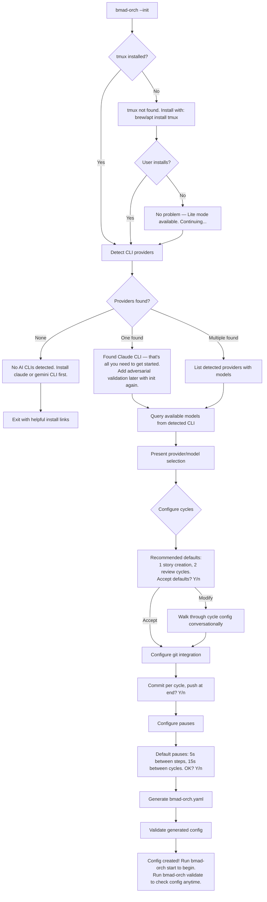
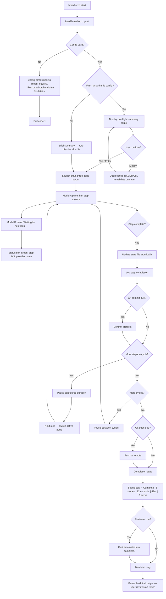
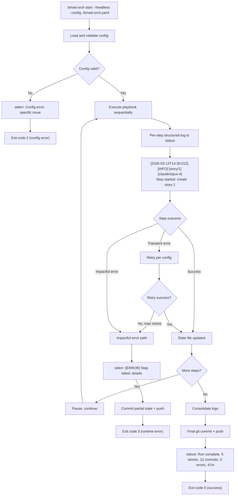

# User Journey Flows

## Flow 1: Init Wizard (Journeys 1 & 4)

**Goal:** Zero to working config in under 5 minutes. Conversational, not form-like.



**Key UX Decisions:**
- Every question has a sensible default that can be accepted with Enter
- Single-provider detection is framed positively ("that's all you need"), not as a limitation
- Model querying happens automatically — users pick from a list, never type model names
- Config validation runs automatically before saving — user never gets a broken config
- Exit with helpful guidance if no providers found — don't leave users stranded

**Conversational Tone Examples:**
- "I found Claude CLI with opus-4 and sonnet-4. Which model for generative steps?" (not "Select primary provider model:")
- "How many review rounds? Most users do 2 — enough to catch issues without burning credits." (not "Enter cycle repeat count:")
- "All set! Here's your config summary:" (not "Configuration generation complete.")

---

## Flow 2: Happy Path Run (Journey 1)

**Goal:** Start to completion with zero intervention. The "start and forget" experience.



**Key UX Moments:**
- **Pre-flight (3 seconds):** Rich table shows providers, cycles, steps, prompts. Scannable, not readable. Catches config typos before burning API credits.
- **Pane switch:** When execution moves from Model A to Model B, the active pane starts streaming and the status bar updates provider name. The previously active pane retains its output as persistent context.
- **Walking away:** Nothing changes about the UX when the user leaves. The TUI continues updating. tmux session persists. User reattaches later and sees current state instantly.
- **Return:** Status bar and pane borders tell the story in one glance. Green + "Complete" = done. Green + streaming = still running. Red = needs attention.

---

## Flow 3: Intervention & Resume (Journey 2)

**Goal:** Handle mid-run interactions and failure recovery without losing trust.

```mermaid
flowchart TD
    subgraph "Mid-Run Intervention"
        A[Model asks a question] --> B[Pane border turns yellow]
        B --> C["Status bar: ⚠ awaiting input"]
        C --> D["Command pane: ⚠ Claude asks: 'Should I include
        error handling ACs for timeout scenarios?'"]
        D --> E{User present?}
        E -->|Yes| F[User types response in command pane]
        F --> G[Input routed to active model subprocess]
        G --> H[Pane border returns to green]
        H --> I[Execution continues]
        E -->|No / Timeout| J{Timeout config?}
        J -->|Skip step| K[Log timeout, skip to next step]
        J -->|Pause| L[Remain in yellow state until user returns]
        J -->|Auto-respond| M[Send configured default response]
        K --> I
        L --> F
        M --> I
    end

    subgraph "Impactful Error"
        AA[Provider crashes / unrecoverable error] --> BB[Pane border turns red]
        BB --> CC["Status bar: ✗ Gemini subprocess terminated"]
        CC --> DD[State file updated atomically]
        DD --> EE[Emergency git commit + push]
        EE --> FF["Command pane log:
        [14:45:02] ✗ ERROR: Gemini subprocess terminated (exit 137)
        [14:45:02] State saved. Partial work committed and pushed.
        [14:45:02] Run bmad-orch resume to continue."]
        FF --> GG[Execution halted]
    end

    subgraph "Resume Flow"
        RA[bmad-orch resume] --> RB[Load state file]
        RB --> RC["Display resume context:
        Last run: 2026-03-13 14:30
        Stopped at: story cycle, step 3/4 (Gemini review)
        Reason: Gemini subprocess terminated
        Completed: 2/5 stories, steps 1-2 of story 3"]
        RC --> RD{Resume options}
        RD --> RE["[1] Re-run failed step (Gemini review of story 3)"]
        RD --> RF["[2] Skip failed step, continue to step 4"]
        RD --> RG["[3] Restart current cycle (story 3 from step 1)"]
        RD --> RH["[4] Start from scratch (all stories)"]
        RE --> RI[Launch TUI, execute from chosen point]
        RF --> RI
        RG --> RI
        RH --> RI
    end
```



**Key UX Decisions:**
- **Yellow state is patient** — It doesn't escalate to red. It waits. The user might be at lunch. Yellow means "when you get back" not "drop everything."
- **Timeout behavior is configurable** — Some users want auto-skip, some want to pause indefinitely, some want a default response. The config decides, not the tool.
- **Error context is immediate** — The command pane log shows exactly what happened, when, and what to do next. No log file hunting required.
- **Resume is contextual** — The resume screen shows enough state to make a decision: what was running, where it stopped, why, and what's already done. Users pick from numbered options, not guess commands.
- **Emergency commit preserves work** — Impactful errors trigger commit + push before halting. Completed work is never lost.

---

## Flow 4: Headless Contract (Journey 3)

**Goal:** Zero-interaction execution with machine-parseable output for CI/CD.



**Exit Code Contract:**

| Code | Meaning | CI/CD Action |
|---|---|---|
| 0 | Success — all cycles completed | Pipeline passes |
| 1 | Usage error — bad flags, missing args | Fix invocation |
| 2 | Config error — invalid yaml, missing provider, bad model | Fix config |
| 3 | Runtime error — impactful failure during execution | Check state file + logs |
| 4 | Provider error — all retries exhausted for a provider | Check provider status |

**Structured Log Format:**
```
[ISO-8601 timestamp] [SEVERITY] [cycle/step] [provider/model] Message
```

**Headless Differences from TUI:**
- No tmux, no Rich, no ANSI colors
- All output to stdout (operational) and stderr (errors)
- State file is the primary status mechanism — external tools poll it
- Retries handled silently with log entries (no user intervention possible)
- Same state file format — a headless run can be resumed in TUI mode and vice versa

---

## Journey Patterns

**Pattern: Escalation Communication**
Used across all flows. State changes are communicated through the same escalation system regardless of mode:
- TUI: pane border color + status bar + command pane log
- Lite: Rich-styled status line + inline log
- Headless: structured log severity + exit code

**Pattern: Graceful Degradation**
Every flow has a degraded path that still delivers value:
- No tmux → Lite mode (still visual)
- No second provider → single-model cycles (still automated)
- Model timeout → configurable fallback (skip/pause/auto-respond)
- Crash → emergency commit (work preserved)

**Pattern: Contextual Decision Points**
Every decision point shows enough context to decide without external investigation:
- Pre-flight: full playbook visible before confirming
- Intervention: the model's question visible in command pane
- Resume: last run state, failure reason, and completed work visible before choosing
- Init wizard: detected providers and models visible before selecting

**Pattern: State as Source of Truth**
The JSON state file is the single source of truth across all modes:
- TUI reads state to render status bar
- Resume reads state to present options
- Headless writes state for external monitoring
- State survives crashes (atomic writes)
- State is human-readable (audit trail) AND machine-parseable (tooling)

## Flow Optimization Principles

1. **Minimum steps to value** — Init wizard: 5 questions with defaults → working config. Happy path run: 1 command → walk away. Resume: 1 command → numbered choice → running.
2. **No dead ends** — Every error state has a clear next action. Every flow has a recovery path. No screen ever leaves the user without guidance on what to do.
3. **Progressive context** — Show less by default, more on demand. Status bar shows headline, log file has the story. Pre-flight shows the plan, `--dry-run` shows every detail.
4. **Mode portability** — A run started in TUI can be resumed in headless and vice versa. A config created by Bobby works for Sarah without modification. State files are portable across modes and users.
